# Passive Information Gathering - Project

## Author
**Muhammad Izaz Haider (Izaz)**

## Purpose of the Project

This project is my first attempt at performing **Passive Information Gathering** as part of ethical hacking and penetration testing. The goal of this project is to demonstrate the process of gathering publicly available information about a target website without directly interacting with the target. Passive Information Gathering is a legal and foundational step in security assessments and penetration testing.

For this project, I chose the website **[Mudassar Academy](https://mudassaracademy.com/)** and performed passive reconnaissance to gather the following information:

- Identifying IP addresses and DNS details
- Gathering domain ownership and domain-related information
- Identifying email addresses and social media profiles linked to the target
- Discovering the web technologies used on the target site
- Identifying subdomains

Various tools and techniques were utilized to gather this information and understand the structure of the target website.

## Table of Contents
- [Passive Information Gathering - Project](#passive-information-gathering---project)
  - [Author](#author)
  - [Purpose of the Project](#purpose-of-the-project)
  - [Table of Contents](#table-of-contents)
  - [Introduction](#introduction)
  - [Overview of Passive Information Gathering](#overview-of-passive-information-gathering)
  - [Target Website](#target-website)
  - [Tools and Techniques Used](#tools-and-techniques-used)
    - [Website Recon \& Footprinting](#website-recon--footprinting)
    - [Whois Enumeration](#whois-enumeration)
    - [Footprinting with Netcraft](#footprinting-with-netcraft)
    - [DNS Recon](#dns-recon)
    - [WAF Detection](#waf-detection)
    - [Subdomain Enumeration](#subdomain-enumeration)
    - [Google Dorks](#google-dorks)
    - [Email Harvesting](#email-harvesting)
    - [Leaked Password Databases](#leaked-password-databases)
    - [Social Media Accounts Enumeration](#social-media-accounts-enumeration)
  - [Conclusion](#conclusion)
  - [Screenshots](#Screenshots)

## Introduction

Passive Information Gathering is a process of gathering information about a target system or website without actively engaging with it. This is a legal process and is the first step in most ethical hacking activities. By collecting publicly available data, we can assess the target’s vulnerabilities and plan further security assessments.

## Overview of Passive Information Gathering

In this project, the focus was on **Passive Information Gathering**, which includes techniques such as:

- Identifying details about the target website (e.g., IP addresses, DNS information, domain ownership)
- Gathering information from publicly accessible sources such as WHOIS, DNS records, and other publicly available databases
- Identifying technologies, social media profiles, email addresses, and subdomains related to the target website

## Target Website

The target website selected for this project is:  
**[Mudassar Academy](https://mudassaracademy.com/)**

This website was chosen as the subject for passive information gathering. The data collected will help demonstrate how passive information can be used to gain insights into the target.

## Tools and Techniques Used

The following tools and techniques were used during the project to gather passive information:

### Website Recon & Footprinting

- **whatis command**  
   - **Use Case**: To gather basic information about a target domain.
   - **Action**: Used `whatis host` to gather information about the target.
   - **Screenshot**: 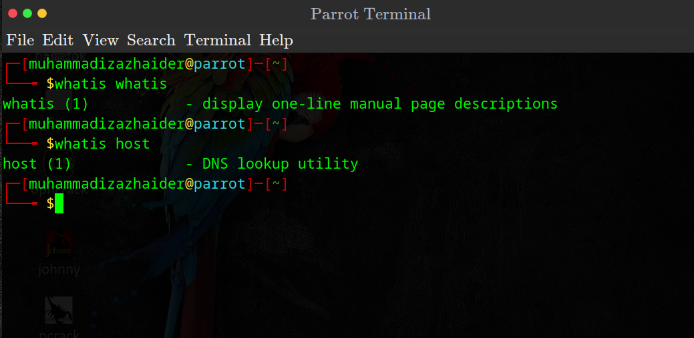

- **host**  
   - **Use Case**: To determine the IP address of the target website.
   - **Action**: Used `host` to retrieve the IP address of Mudassar Academy.
   - **Screenshot**: 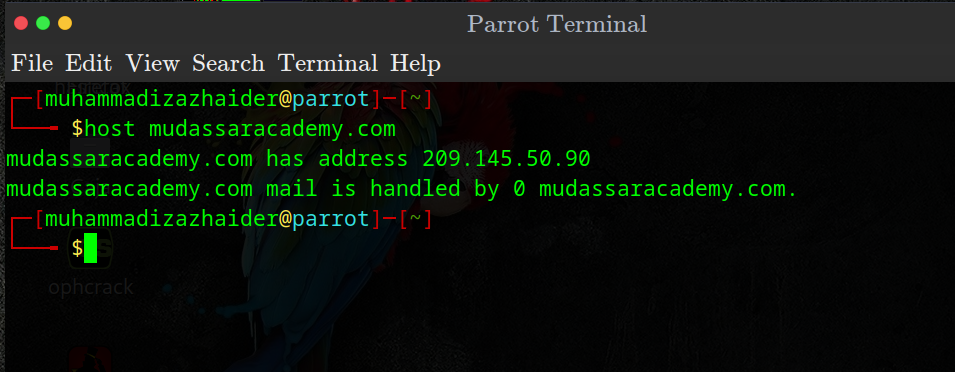

- **robots.txt**  
   - **Use Case**: To identify disallowed pages from being indexed by search engines.
   - **Action**: Accessed `mudassaracademy.com/robots.txt` to see the blocked pages.
   - **Screenshot**: 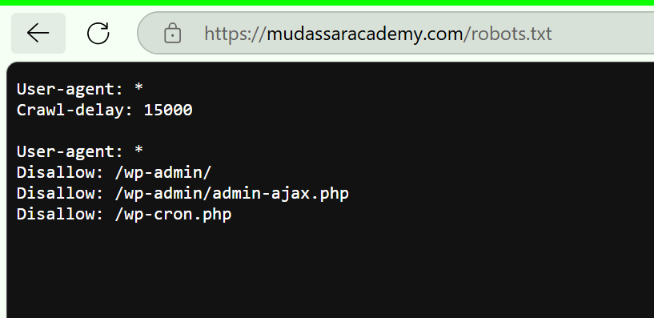

- **sitemap.xml**  
   - **Use Case**: To discover the pages and resources of the website.
   - **Action**: Accessed `mudassaracademy.com/sitemap.xml` and discovered 6 sitemaps.
   - **Screenshot**: 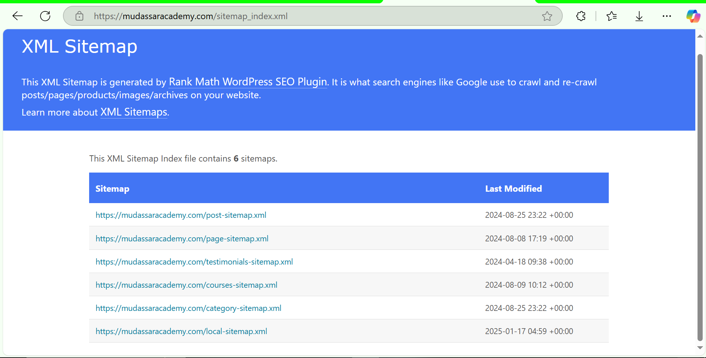

- **BuiltWith Extension**  
   - **Use Case**: To determine the technologies used on the website.
   - **Action**: Used the BuiltWith extension to reveal web technologies.
   - **Screenshot**: 

- **Wappalyzer**  
   - **Use Case**: To detect CMS, frameworks, and libraries used by the website.
   - **Action**: Installed Wappalyzer to reveal technologies such as WordPress, JavaScript frameworks, etc.
   - **Screenshot**: 

- **WhatWeb**  
   - **Use Case**: A next-gen web scanner to identify technologies used.
   - **Action**: Used WhatWeb to identify the target's web technologies.
   - **Screenshot**: 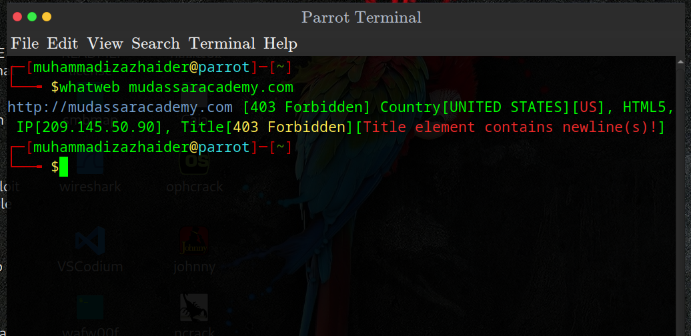

- **HTTrack**  
   - **Use Case**: To mirror the website for offline browsing, useful for penetration testing.
   - **Action**: Used HTTrack to copy the target website for offline use.
   - **Screenshot**: 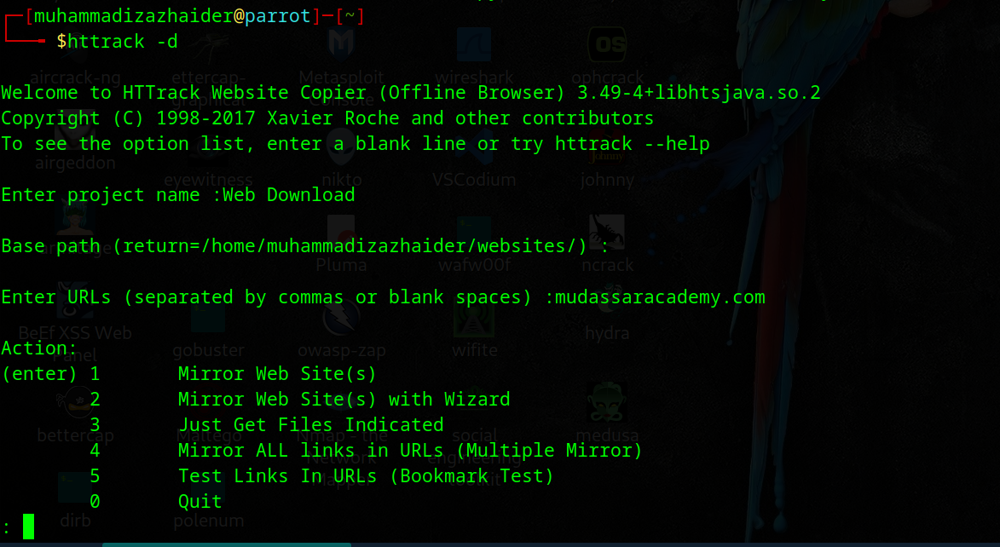

### Whois Enumeration

- **whois**  
   - **Use Case**: To gather domain registration details.
   - **Action**: Used `whois` to retrieve domain information for Mudassar Academy.
   - **Screenshot**: 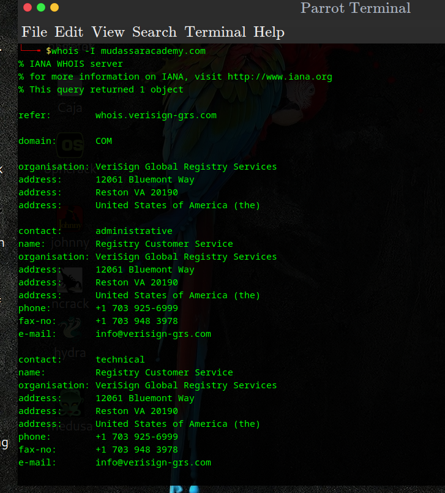

- **who.is**  
   - **Use Case**: To get domain registration information and check the domain’s availability.
   - **Action**: Accessed `who.is` for detailed domain records.
   - **Screenshot**: 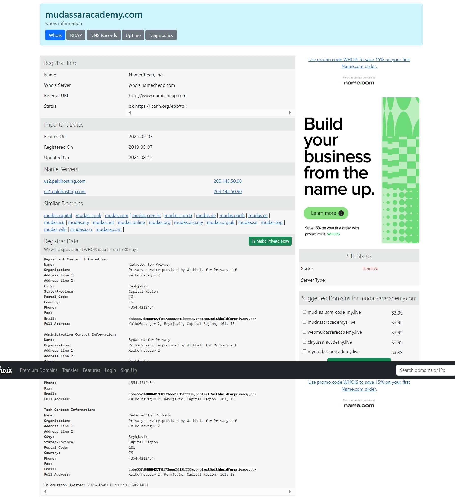

### Footprinting with Netcraft

- **Netcraft**  
   - **Use Case**: To gather detailed information about the web server and technologies.
   - **Action**: Used Netcraft for footprinting the target.
   - **Screenshot**: 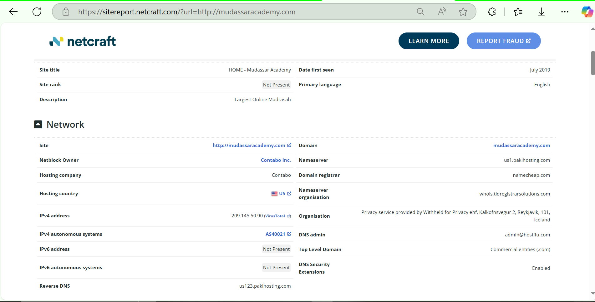

### DNS Recon

- **dnsrecon**  
   - **Use Case**: To perform DNS enumeration and gather DNS records.
   - **Action**: Used `dnsrecon` for DNS information gathering.
   - **Screenshot**: 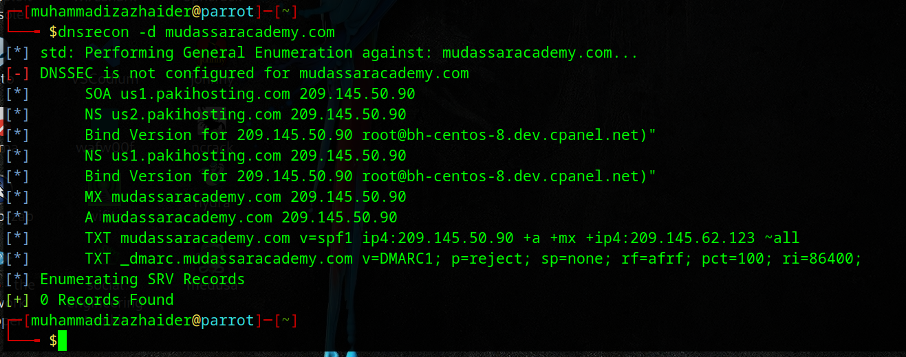

- **dnsdumpster.com**  
   - **Use Case**: To discover DNS records and gather related data.
   - **Action**: Used `dnsdumpster.com` to discover DNS information.
   - **Screenshot**: 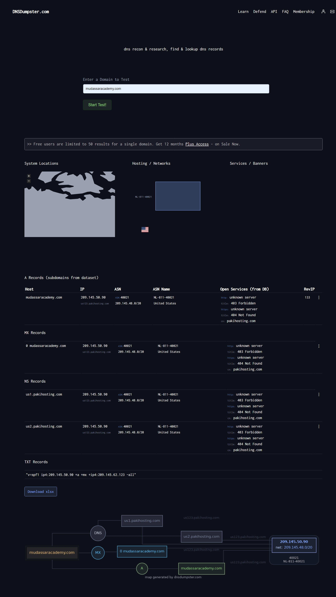

- **nslookup**  
   - **Use Case**: To query the DNS records and gather additional data.
   - **Action**: Performed queries using `nslookup`.
   - **Screenshot**: 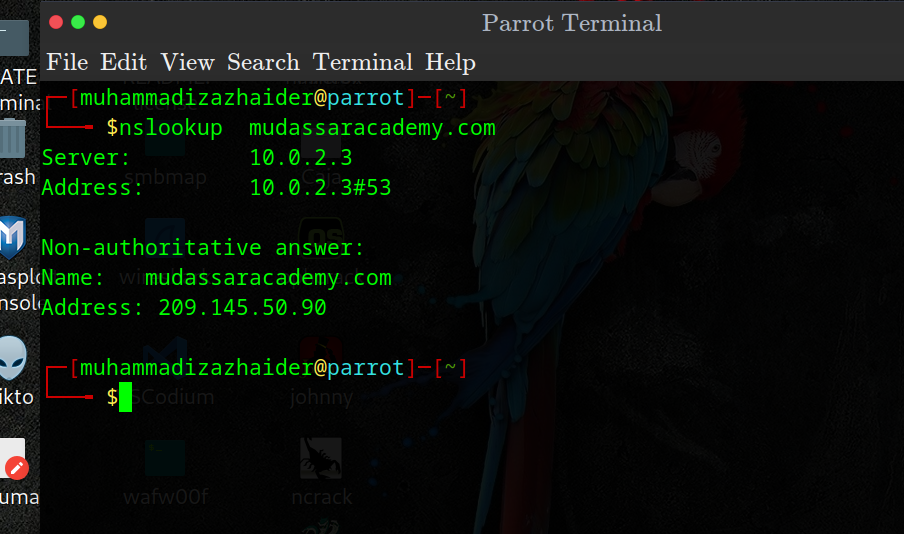

- **dig**  
   - **Use Case**: To perform DNS lookups and gather detailed DNS records.
   - **Action**: Used `dig` for DNS record retrieval.
   **Screenshot**: 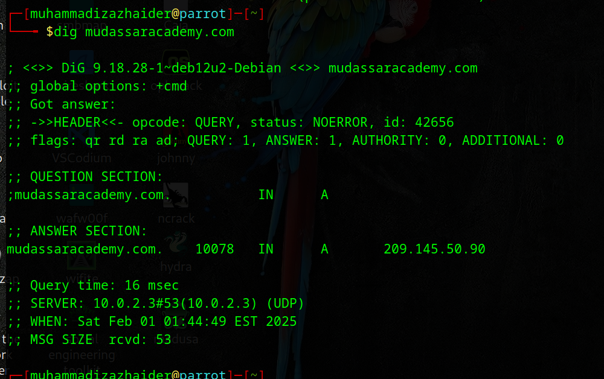

### WAF Detection

- **wafw00f**  
   - **Use Case**: To detect the presence of Web Application Firewalls (WAF).
   - **Action**: Used `wafw00f` to check if the target is protected by a WAF.
   - **Screenshot**: 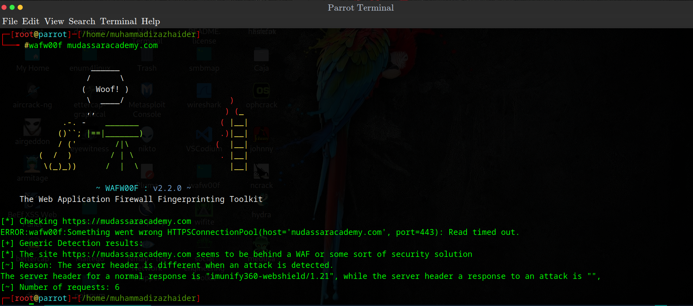

### Subdomain Enumeration

- **sublist3r**  
   - **Use Case**: To perform subdomain enumeration.
   - **Action**: Used `sublist3r` to identify subdomains associated with the target.
   - **Screenshot**: 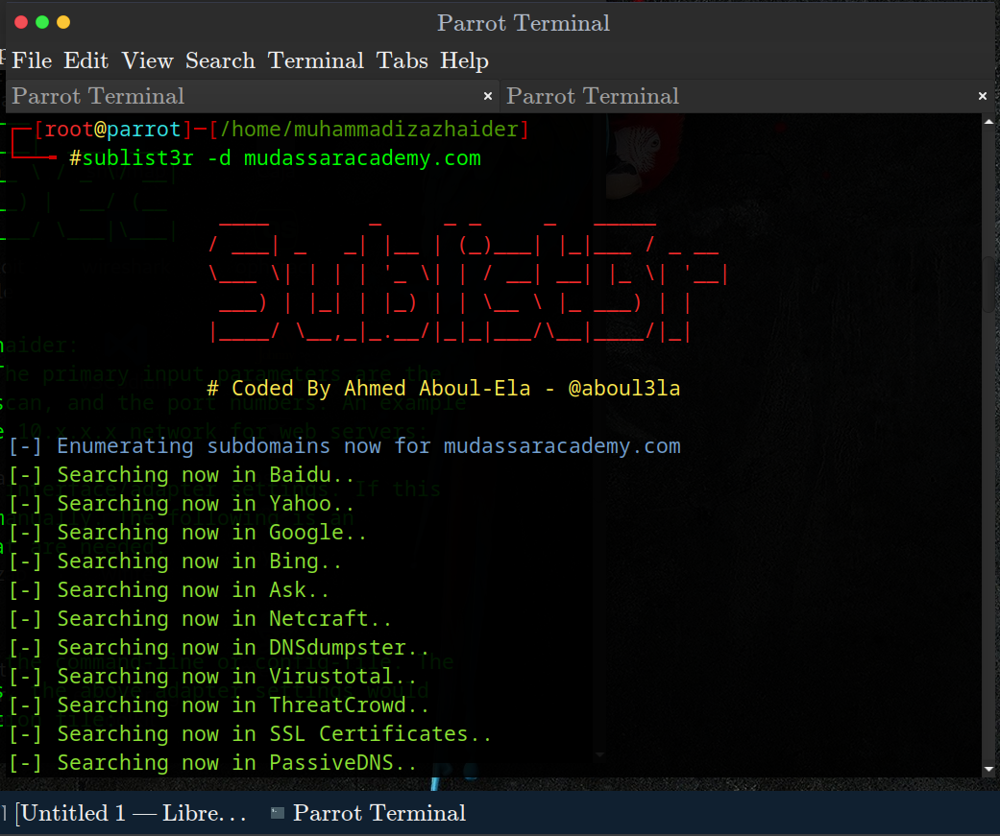

### Google Dorks

- **Google Dorks**  
   - **Use Case**: To use Google search operators to find information related to the target.
   - **Action**: Performed Google dorking to find hidden data or vulnerabilities.
   - **Screenshot**: 

### Email Harvesting

- **theHarvester**  
   - **Use Case**: To gather email addresses and other relevant data.
   - **Action**: Used `theHarvester` to extract email addresses associated with the target.
   - **Screenshot**: 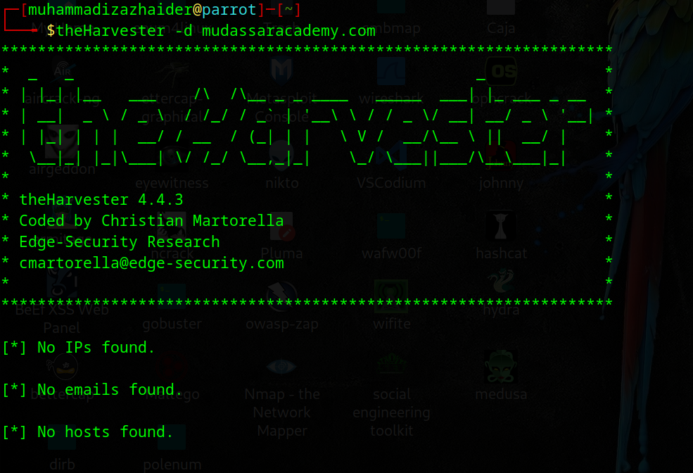

### Leaked Password Databases

- **Have I Been Pwned**  
   - **Use Case**: To check if the target’s data has been part of any security breaches.
   - **Action**: Used `Have I Been Pwned` to check for leaked passwords.
   - **Screenshot**: 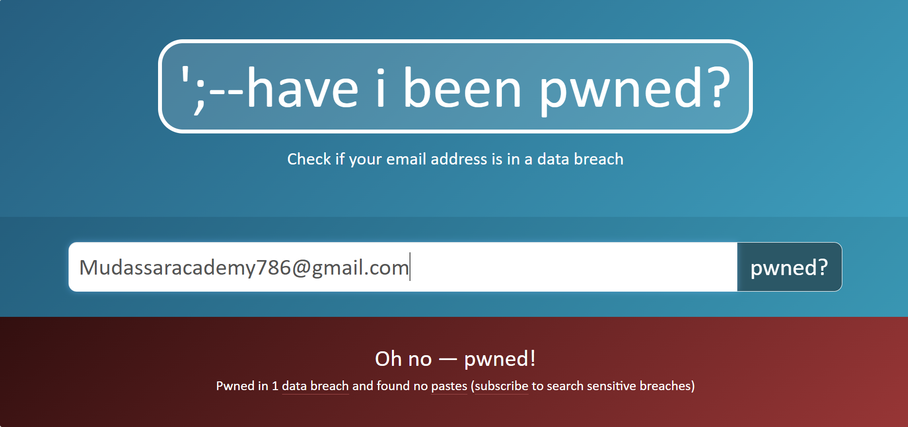
   - 
### Social Media Accounts Enumeration

- **Use Case**: To identify social media profiles linked to the target for reconnaissance purposes.
- **Action**: Used various tools and techniques to find associated social media accounts.
- **Screenshot**: 

## Conclusion

Passive Information Gathering is a valuable technique for ethical hackers and penetration testers to collect useful data about a target. By using various tools and techniques, I was able to gather crucial information that could aid in further security assessments. This project demonstrates how passive techniques can be employed to perform reconnaissance without directly interacting with the target, maintaining legality and privacy.

## Screenshots

Here are the Screenshots of tools and techniques used during the project:

- **whatis command**: 
- **host command**: 
- **robots.txt**: 
- **sitemap.xml**: 
- **BuiltWith Extension**: 
- **Wappalyzer**: 
- **WhatWeb**: 
- **HTTrack**: 
- **Netcraft**: 
- **whois**: 
- **who.is**: 
- **dnsrecon**: 
- **dnsdumpster**: 
- **nslookup**: 
- **dig**: 
- **wafw00f**: )
- **sublist3r**: 
- **Google Dorks**: 
- **theHarvester**: 
- **Have I Been Pwned**: 
- **Social Media Enumeration**: 
